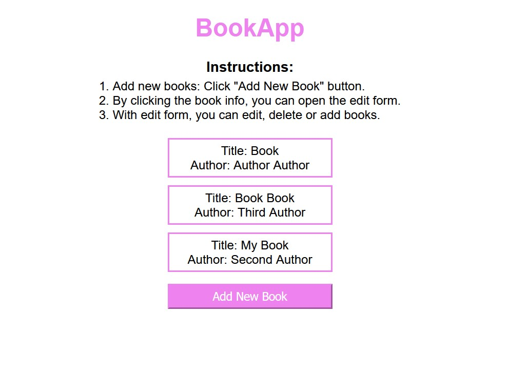

# BookApp
Single Page App practice project with Django.  
You can add, delete and edit books listed in the front page ordered by title.

## Installation:

Clone the repository.

Use the following commands in powershell:
1. python3 -m venv venv
2. .\venv\Scripts\Activate.ps1
3. pip install -r requirements.txt
4. cd booklist
5. py manage.py migrate
6. py manage.py runserver
7. Open the server with url: http://127.0.0.1:8000/
